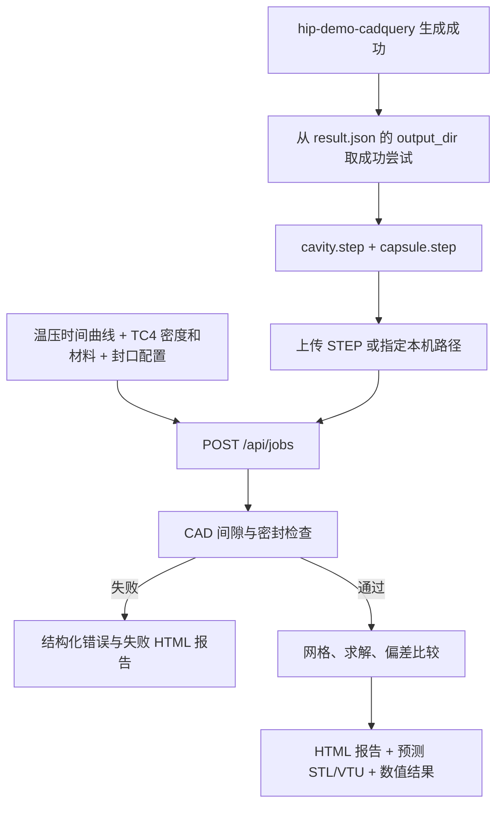

# CadQuery 输出接入 HIPForm

HIPForm 现已提供带 Swagger 的本机 HTTP 接口。详细请求格式、参数字段、错误代码和上游 Python
调用示例见 [HTTP API 使用说明](api.md)。

## 端到端流程

服务启动命令：`uv run --locked hipform serve --port 8000`。
Swagger：<http://127.0.0.1:8000/docs>。
接口已经实现，但没有改动上游仓库；需在上游任务成功分支调用接口才会自动触发。

## 文件含义

依据上游提交 [`027f4d4`](https://github.com/YuShenLiu06/hip-demo-cadquery/tree/027f4d45411d1c4ee250a64746eecbace4bba9ea)：

| 文件 | 含义和用法 |
| --- | --- |
| 原始输入 STEP | 输入参考件，不应自动当成粉末域 |
| `assembly.step` | 原始参考件与包套的装配，用于查看和追溯 |
| `cavity.step` | 包套内部 box/cylinder 包络，粉末填满主内腔时用作仿真粉末域 |
| `capsule.step` | 壳壁及抽气管材料实体；上游默认输出尚未封口 |
| `design.json` | 包套几何设计参数，不是 HIP 材料/工艺配置 |
| `validation.json` | 上游几何检查结果，不等同于 HIP 仿真通过 |

上游的 `result.json.output_dir` 指向实际被接受的 `attempt-N`，不要固定使用 `attempt-1`。
上游 `generate()` 单独导出 `inner` 作为 `cavity.step`，装配中的 `part` 是原始输入。
上游 `validate()` 在内存中临时加封口检查包围关系，但导出的 `capsule.step` 不包含这个封口。
`bore_clear` 特意检查抽气孔开放，所以 CAD 验证成功并不代表当前几何已是密封后的 HIP 状态。

## 本次文件验证的解释

本机源文件位于 `/Users/zeroduan/Documents/Codex/freecad/`：

- `assembly.step`：包含 300 mm 参考正方体和包套，两者有 1 mm 设计间隙。
- `cavity.step`：302 mm 主内腔，与包套内壁贴合，材料最小间距为 0。
- `capsule.step`：主外形 306 mm、壁厚 2 mm，抽气管外径 10 mm、内径 6 mm、顶部 z=193 mm，尚未封口。

早先 `assembly-001` 将装配中的 300 mm 参考件误作为粉末域，得到材料不连接错误。
这仅证明该输入解释不符合求解器要求，不能证明上游包套设计错误。
其记录仍保存在 [旧验证记录](../simulation-runs/assembly-001/VALIDATION.md)。

新接口使用独立的 `cavity.step` 与 `capsule.step` 时，材料贴合检查通过，但开放抽气孔返回
`open_capsule` 并生成失败 HTML。明确实际封口方案后，传入预封口 STEP 或 `config.seal` 再计算。
程序不会自行封孔或改变初始粉末域。

## 配置与报告

先通过 `GET /api/configs/default` 取得参数，再在 `POST /api/configs` 保存修改后的配置；
或者把 `config` 直接放在 `POST /api/jobs` 请求中。
温压时间曲线、粉末初始相对密度、材料数据、网格和公差均沿用当前可配置模型。
每个任务保存输入与配置快照；修改配置不影响已经提交的任务。

提交接口返回任务 ID。用 `GET /api/jobs/{job_id}` 轮询，完成后在浏览器打开 `report_url`：

- `completed`：完整仿真报告、预测粉末 STL、装配 VTU、温压/密度历程等。
- `failed`：错误原因、阶段和失败报告，无有效预测模型。

现有 CLI 仍可单独使用，成功或失败的报告均位于其输出目录 `report.html`。
此前 [L 形演示报告](../simulation-runs/public-demo/run/report.html) 只是示例，不是这次正方体的结果。

“还原零件”在本版指按输入粉末域与工艺参数预测终态表面，不代表唯一逆向设计或生成解析 STEP。
当前比较仍是预测终态相对初始型腔；若要验收相对原始成品目标的尺寸，还需要独立目标几何比较。
材料参数未标定、小应变范围和密度越界提示继续保留，计算完成不等于工程验收。

## 源码依据

- [上游 engine.py](https://github.com/YuShenLiu06/hip-demo-cadquery/blob/027f4d45411d1c4ee250a64746eecbace4bba9ea/hip_capsule/engine.py)
- [上游 run_job.py](https://github.com/YuShenLiu06/hip-demo-cadquery/blob/027f4d45411d1c4ee250a64746eecbace4bba9ea/run_job.py)
- [当前 HTTP API](../src/hipform/api.py)
- [任务与配置存储](../src/hipform/jobs.py)
- [模型与参数说明](simulation.md)
