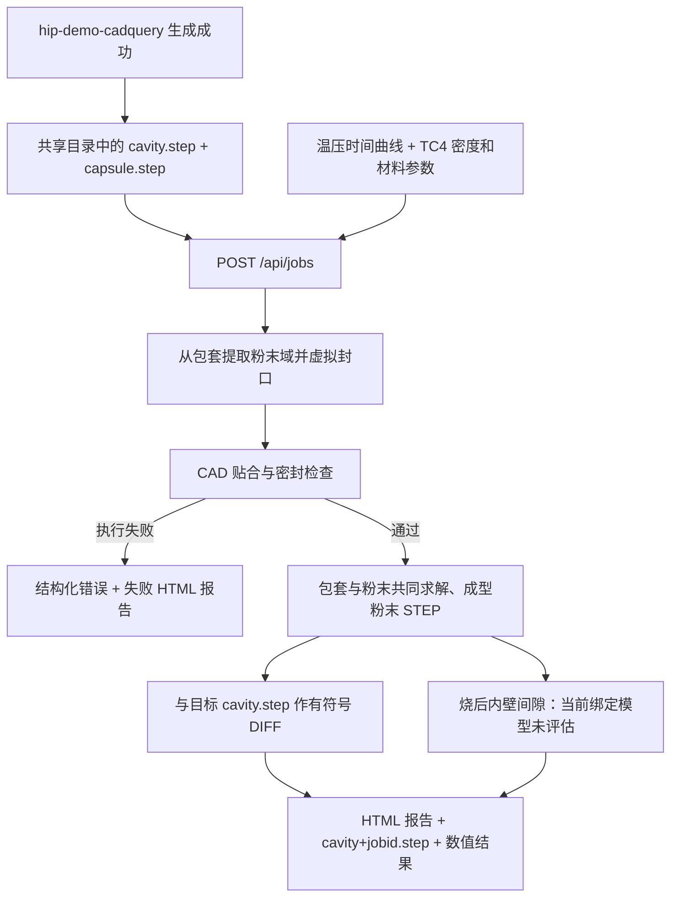

# CadQuery 输出接入 HIPForm

HIPForm 的几何输入只有 `cavity.step` 和 `capsule.step`。服务直接读取固定目录中的这两个文件，调用方提交工艺配置后即可触发验证；没有单独的上传或逐次填写 STEP 路径步骤。

## 端到端流程



## 两个文件的含义

| 文件 | 本项目使用方式 |
| --- | --- |
| `cavity.step` | 用户指定的目标成品模型，用于最终尺寸比较 |
| `capsule.step` | 包套壳壁及抽气管材料实体，程序从中独立推导主粉末域 |

程序不读取 `assembly.step`，也不把目标成品直接作为装填粉末域。未封口的直圆抽气管在仿真副本中虚拟封口，原文件保留；允许支持形状的密闭管腔残余空间。不能可靠识别的几何将明确失败。

## 本机启动与调用

安装依赖后，在包含两份 STEP 的目录启动服务。本机当前文件在 `/Users/zeroduan/Documents/Codex/freecad`：

```bash
cd /Users/zeroduan/Documents/Codex/freecad
/Users/zeroduan/Documents/GitHub/HIPForm/.venv/bin/hipform serve --port 8000
```

打开 Swagger：<http://127.0.0.1:8000/docs>。在 `POST /api/jobs` 提交：

```json
{"name": "当前包套验证", "config": {}}
```

`config: {}` 使用当前默认工艺。也可提供修改后的配置，或只提供配置接口返回的 `config_id`。完整字段、接口示例见 [API 说明](api.md)。

服务读取文件后保存独立快照，每个任务都生成新 ID，已有结果不会阻止下一次提交。源文件在任务受理完成后即可用于下一次设计；历史任务仍使用自己的副本。

上游若采用 `result.json.output_dir` 指向的 `attempt-N` 目录，应在成功分支将本次的两份 STEP 写入约定共享目录，再调用 `POST /api/jobs`。当前没有修改上游项目，也没有自动监听其输出；接入后才会自动触发。

## 报告和评估状态

查询 `GET /api/jobs/{job_id}`，返回的 `report_url` 可直接打开。报告磁盘路径为：

```text
simulation-runs/api/jobs/<job_id>/run/report.html
```

同目录的 `cavity+<job_id>.step` 是成型粉末三角面 BREP，位置对应包套仍附着的终态，未包含去包套后的应力释放。包套参与共同求解，报告显示烧制前后包套与粉末。`artifacts` 提供本任务 STEP、STL/VTU、温压/密度历程及 JSON 结果下载链接。

预测成品与目标 `cavity.step` 使用原坐标系进行有符号 DIFF：欠尺寸为负，余量为正，仅作测量。平面 0～10 mm、非平面 0～20 mm 是**烧后粉末到包套内壁的间隙要求**，不用于目标 DIFF。当前两材料共享界面节点，零间隙由绑定约束强制产生，无法预测实际分离，因此不判定间隙通过或失败。

- `status: completed`：计算完成，应继续查看 `result.validation_status`。
- `result.validation_status: not_assessed`：真实烧后间隙尚不能评估，不能当作通过。
- `comparison.status: measured`：目标 DIFF 完成，保留数值和位置，无尺寸通过/失败状态。
- `contact_assessment.status: not_assessed`：详见 `contact-assessment.json`，原因码为 `bonded_interface_prevents_separation`。
- `status: failed`：几何或计算流程失败，查看 `error`、报告和日志。

当前 `upstream-advice.json` 为 `status: not_assessed`、`recommendations: []`，`blocked_reason` 说明需要有限应变接触求解及高温材料标定。上游不应依据绑定零间隙或目标 DIFF 自动修改包套参数。

20号钢、TC4、900℃、120 MPa、保温保压3小时和初始相对密度0.65已纳入默认配置。当前小应变有限元模型未经高温试验标定；材料强度参考值和经验收缩率不等同于已标定的本构参数，结果不能作为真实工件工程验收。
